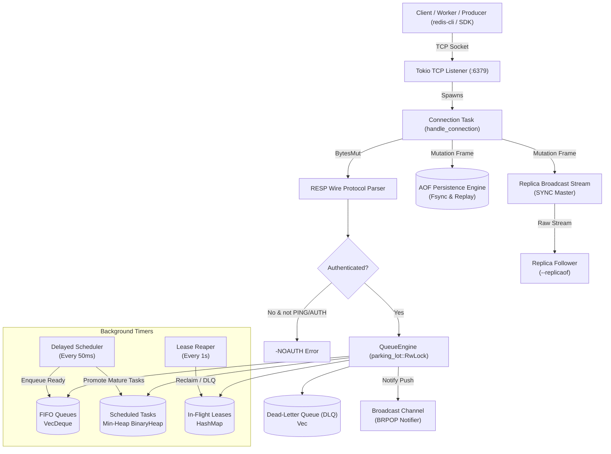
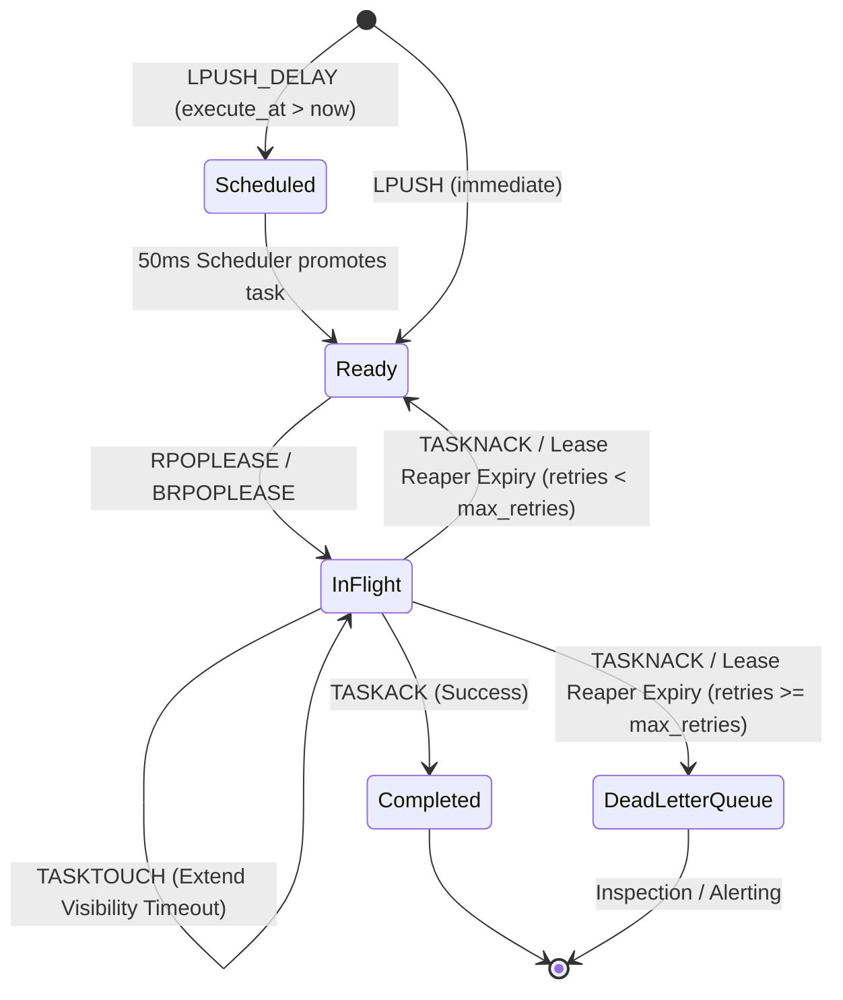
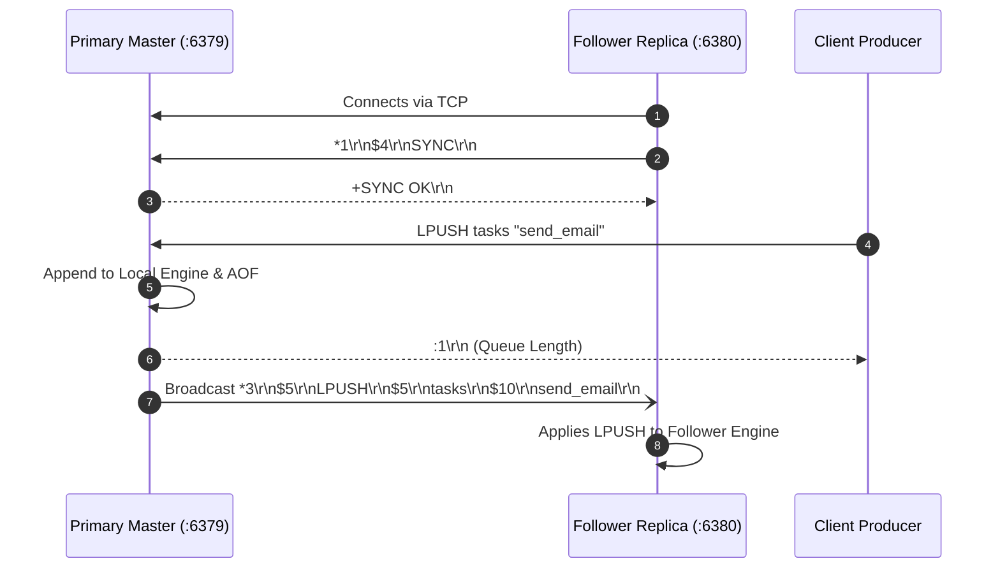

# Distributed Task Queue

A high-performance, asynchronous distributed task queue engine built in Rust, powered by Tokio and compatible with the Redis Serialization Protocol (RESP).

---

## ⚡ Overview

`distributed_task_queue` is a lightweight, low-latency distributed task broker and coordination engine. It implements an asynchronous TCP event loop, complete RESP wire protocol parsing, atomic queue primitives, visibility timeouts with Dead-Letter Queues (DLQ), Append-Only File (AOF) persistence with background compaction (`BGREWRITEAOF`), and live primary-to-replica mutation streaming.

### Key Highlights

- **Asynchronous Network I/O**: Non-blocking TCP server built on [Tokio](https://tokio.rs/), serving clients concurrently.
- **Concurrent In-Memory Engine**: Thread-safe task state backed by `parking_lot::RwLock` for low-overhead read/write locking across worker threads.
- **RESP Protocol Interface**: Wire-level compatibility with the Redis Serialization Protocol (by default on port `6379`), enabling native integration with existing Redis clients, CLIs, and microservices.
- **Non-Busy Blocking Pop (`BRPOP` & `BRPOPLPUSH`)**: Event-driven notification broadcasting via Tokio channels, allowing worker threads to suspend awaiting tasks without spinning CPU cycles.
- **Visibility Timeouts & Dead-Letter Queue (DLQ)**: Lease-based task dispatch with automatic background reaper recycling unacknowledged tasks (`TASKACK`) and routing repeatedly failed tasks (`TASKNACK`) to a DLQ after max retries.
- **AOF Persistence & Log Compaction (`BGREWRITEAOF`)**: Continuous append-only mutation persistence, startup state replay, and online atomic log compaction.
- **Node Replication (`SYNC`)**: Live real-time replication stream pushing mutations to replica nodes.
- **Structured Telemetry & High Test Coverage**: Unit and integration test suites covering protocol parsing, concurrent queue semantics, and TCP loopback operations.

---

### 🏗️ System Architecture & Workflow Diagrams

### 1. High-Level Node Architecture



### 2. Task Lifecycle & Lease State Machine



### 3. Primary-Replica Synchronization (`SYNC` / `--replicaof`)



---

## 🛠️ Supported Commands

| Command | Syntax | Description |
| :--- | :--- | :--- |
| `PING` | `PING` | Health check probe (returns `+PONG`) |
| `AUTH` | `AUTH <password>` | Authenticate client session when `--requirepass` is set |
| `LPUSH` | `LPUSH <queue> <payload>` | Push element to the head of the queue |
| `LPUSH_DELAY` | `LPUSH_DELAY <queue> <delay_secs> <payload>` | Schedule an item to be enqueued after `delay_secs` |
| `RPOP` | `RPOP <queue>` | Pop element from the tail of the queue |
| `RPOPLEASE` | `RPOPLEASE <queue> [visibility_secs]` | Atomically pop and lease task with unique Task ID & visibility timeout |
| `BRPOPLEASE` | `BRPOPLEASE <queue> <timeout> [visibility_secs]` | Non-busy blocking pop with lease & Task ID |
| `TASKTOUCH` | `TASKTOUCH <queue> <task_id> [extend_secs]` | Heartbeat command extending visibility timeout for in-flight tasks |
| `TASKACK` | `TASKACK <queue> <task_id>` | Acknowledge completed task lease |
| `TASKNACK` | `TASKNACK <queue> <task_id>` | Negative acknowledge; increments retry count or routes to DLQ |
| `RPOPLPUSH` | `RPOPLPUSH <source> <dest>` | Atomically pop from tail of source and push to head of destination |
| `BRPOP` | `BRPOP <queue> [queue ...] <timeout>` | Non-busy blocking pop with timeout (seconds) |
| `BRPOPLPUSH` | `BRPOPLPUSH <source> <dest> <timeout>`| Blocking pop from source and push to destination with timeout |
| `BGREWRITEAOF` | `BGREWRITEAOF` | Atomically compacts the AOF log from current memory state |
| `SYNC` | `SYNC` | Subscribes connected replica node to live mutation byte stream |
| `INFO` | `INFO` | Reports queue metrics, in-flight leases, and DLQ counts |

---

## 🐳 Docker & Cluster Deployment

Run a complete distributed cluster with primary master and live follower replica in one command:

```bash
docker compose up --build
```

- **Master Node**: listening on `0.0.0.0:6379` with authentication (`supersecretpass`) and persistent storage volume.
- **Replica Follower**: listening on `0.0.0.0:6380`, connected to master with auto-reconnecting live replication.

## 📦 Dependencies

- **[tokio](https://crates.io/crates/tokio)**: Asynchronous runtime with full networking and synchronization primitives.
- **[bytes](https://crates.io/crates/bytes)**: Zero-copy slicing and efficient binary buffers.
- **[parking_lot](https://crates.io/crates/parking_lot)**: Fast, compact synchronization locks (`RwLock`, `Mutex`).
- **[clap](https://crates.io/crates/clap)**: Command-line argument parsing.
- **[tracing](https://crates.io/crates/tracing)** / **[tracing-subscriber](https://crates.io/crates/tracing-subscriber)**: Production-grade observability and diagnostic logging.

---

## 🚀 Getting Started

### Prerequisites

Ensure you have the Rust toolchain installed:

```bash
rustc --version
cargo --version
```

### Running the Server

Clone the repository and launch the server:

```bash
git clone https://github.com/dragpk247/distributed_task_queue.git
cd distributed_task_queue

# Run primary master with optional password protection
cargo run -- --bind 127.0.0.1:6379 --requirepass secret123

# Run replica follower connecting to primary
cargo run -- --bind 127.0.0.1:6380 --replicaof 127.0.0.1:6379
```

### Interacting via redis-cli

```bash
# 1. Authenticate (if --requirepass configured)
redis-cli -p 6379 AUTH secret123

# 2. Push immediate tasks
redis-cli -p 6379 LPUSH jobs "process_video_1"

# 3. Schedule delayed task (runs in 10 seconds)
redis-cli -p 6379 LPUSH_DELAY jobs 10.0 "reminder_email_worker"

# 4. Lease task with 30-second visibility timeout
redis-cli -p 6379 RPOPLEASE jobs 30

# 5. Heartbeat / extend lease
redis-cli -p 6379 TASKTOUCH jobs task-1 30

# 6. Settle task
redis-cli -p 6379 TASKACK jobs task-1

# 7. Non-busy blocking pop (waits up to 10 seconds)
redis-cli -p 6379 BRPOP jobs 10

# 8. Trigger AOF compaction
redis-cli -p 6379 BGREWRITEAOF
```

### Running Test Suite

```bash
# Run unit and integration tests (25 passing tests)
cargo test

# Run linter
cargo clippy --all-targets -- -D warnings
```

---

## 📄 License

Licensed under either of:
- Apache License, Version 2.0 ([LICENSE-APACHE](LICENSE-APACHE) or http://www.apache.org/licenses/LICENSE-2.0)
- MIT license ([LICENSE-MIT](LICENSE-MIT) or http://opensource.org/licenses/MIT)

at your option.
