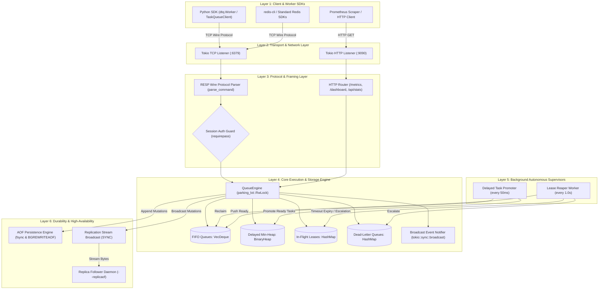
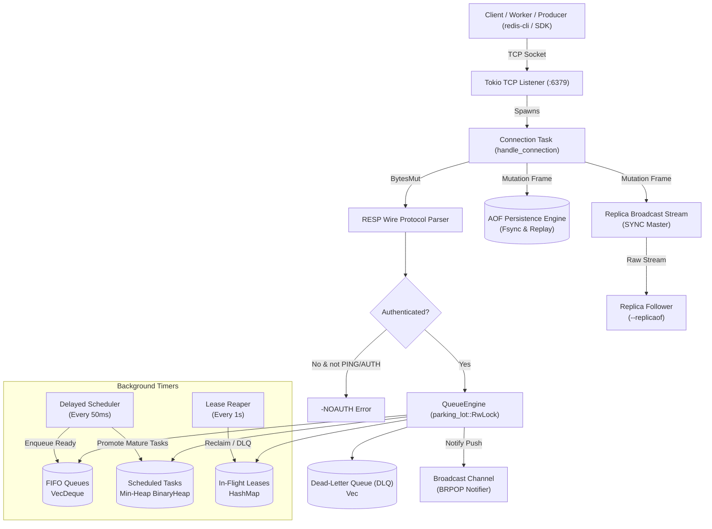
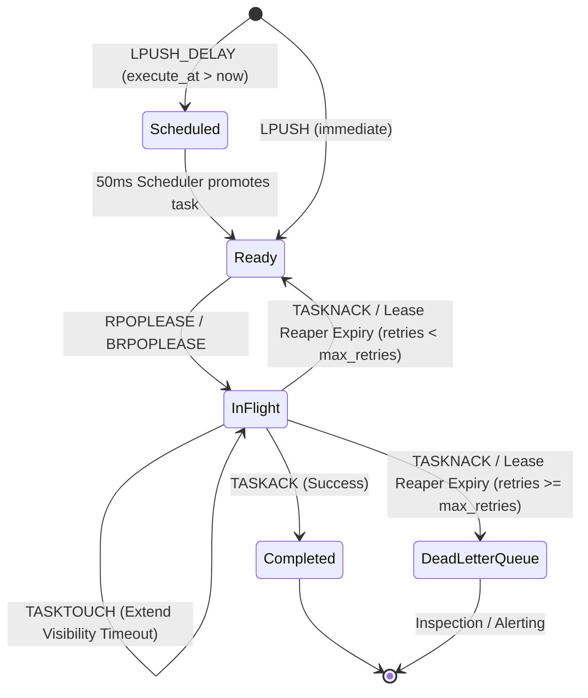
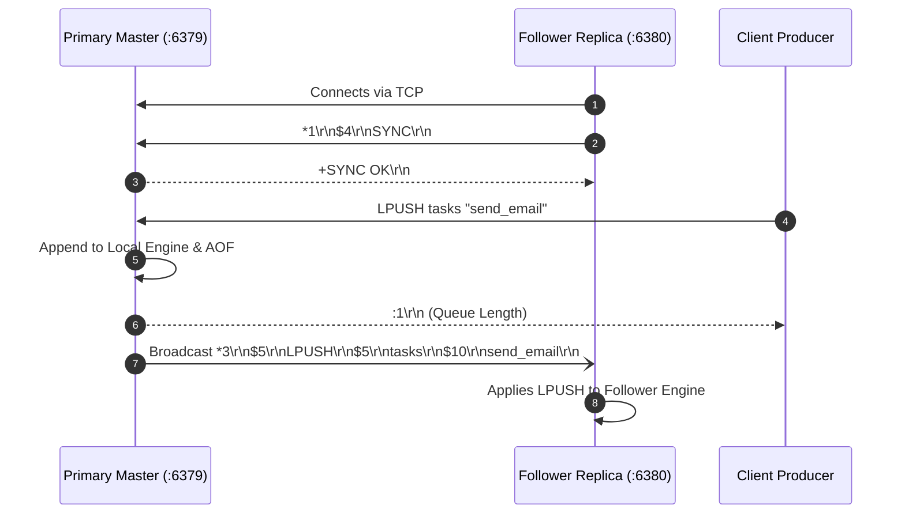

# Distributed Task Queue

A high-performance, asynchronous distributed task queue engine built in Rust, powered by Tokio and compatible with the Redis Serialization Protocol (RESP).

---

## ⚡ Overview

`distributed_task_queue` is a lightweight, low-latency distributed task broker and coordination engine. It implements an asynchronous TCP event loop, complete RESP wire protocol parsing, atomic queue primitives, visibility timeouts with Dead-Letter Queues (DLQ), Append-Only File (AOF) persistence with background compaction (`BGREWRITEAOF`), and live primary-to-replica mutation streaming.

### Key Highlights

- **Asynchronous Network I/O**: Non-blocking TCP server built on [Tokio](https://tokio.rs/), serving clients concurrently.
- **Concurrent In-Memory Engine**: Thread-safe task state backed by `parking_lot::RwLock` for low-overhead read/write locking across worker threads.
- **RESP Protocol Interface**: Wire-level compatibility with the Redis Serialization Protocol (by default on port `6379`), enabling native integration with existing Redis clients, CLIs, and microservices.
- **Non-Busy Blocking Pop (`BRPOP` & `BRPOPLPUSH`)**: Event-driven notification broadcasting via Tokio channels, allowing worker threads to suspend awaiting tasks without spinning CPU cycles.
- **Visibility Timeouts & Dead-Letter Queue (DLQ)**: Lease-based task dispatch with automatic background reaper recycling unacknowledged tasks (`TASKACK`) and routing repeatedly failed tasks (`TASKNACK`) to a DLQ after max retries.
- **AOF Persistence & Log Compaction (`BGREWRITEAOF`)**: Continuous append-only mutation persistence, startup state replay, and online atomic log compaction.
- **Node Replication (`SYNC`)**: Live real-time replication stream pushing mutations to replica nodes.
- **Structured Telemetry & High Test Coverage**: Unit and integration test suites covering protocol parsing, concurrent queue semantics, and TCP loopback operations.

---

## 🏛️ Layered System Architecture

The project is structured into 6 clear, decoupled architectural layers:



### Layer Breakdown

| Layer | Responsibility | Key Modules |
| :--- | :--- | :--- |
| **Layer 1: Clients & SDKs** | Ergonomic producers, task decorators, auto-heartbeating, and metrics consumers | `sdk/python/dtq/` (`client.py`, `worker.py`) |
| **Layer 2: Transport** | High-concurrency asynchronous I/O and socket acceptance loops | `server.rs`, `http_server.rs` |
| **Layer 3: Protocol & Auth** | Zero-copy RESP frame parsing, response serializers, and session auth validation | `protocol.rs`, `http_server.rs` |
| **Layer 4: Engine & Storage** | Thread-safe in-memory FIFO queues, visibility leases, min-heap scheduler, DLQs, event broadcaster | `engine.rs` |
| **Layer 5: Supervisors** | Autonomous background daemon tasks for lease recycling and delayed task promotion | `server.rs`, `engine.rs` |
| **Layer 6: Durability & HA** | Append-only logging with background atomic compaction and follower replication sync | `aof.rs`, `server.rs` |

---

## 🏗️ System Architecture & Workflow Diagrams

### 1. High-Level Node Architecture



### 2. Task Lifecycle & Lease State Machine



### 3. Primary-Replica Synchronization (`SYNC` / `--replicaof`)



---

## 🛠️ Supported Commands

| Command | Syntax | Description |
| :--- | :--- | :--- |
| `PING` | `PING` | Health check probe (returns `+PONG`) |
| `AUTH` | `AUTH <password>` | Authenticate client session when `--requirepass` is set |
| `LPUSH` | `LPUSH <queue> <payload>` | Push element to the head of the queue |
| `LPUSH_DELAY` | `LPUSH_DELAY <queue> <delay_secs> <payload>` | Schedule an item to be enqueued after `delay_secs` |
| `RPOP` | `RPOP <queue>` | Pop element from the tail of the queue |
| `RPOPLEASE` | `RPOPLEASE <queue> [visibility_secs]` | Atomically pop and lease task with unique Task ID & visibility timeout |
| `BRPOPLEASE` | `BRPOPLEASE <queue> <timeout> [visibility_secs]` | Non-busy blocking pop with lease & Task ID |
| `TASKTOUCH` | `TASKTOUCH <queue> <task_id> [extend_secs]` | Heartbeat command extending visibility timeout for in-flight tasks |
| `TASKACK` | `TASKACK <queue> <task_id>` | Acknowledge completed task lease |
| `TASKNACK` | `TASKNACK <queue> <task_id>` | Negative acknowledge; increments retry count or routes to DLQ |
| `RPOPLPUSH` | `RPOPLPUSH <source> <dest>` | Atomically pop from tail of source and push to head of destination |
| `BRPOP` | `BRPOP <queue> [queue ...] <timeout>` | Non-busy blocking pop with timeout (seconds) |
| `BRPOPLPUSH` | `BRPOPLPUSH <source> <dest> <timeout>`| Blocking pop from source and push to destination with timeout |
| `BGREWRITEAOF` | `BGREWRITEAOF` | Atomically compacts the AOF log from current memory state |
| `SYNC` | `SYNC` | Subscribes connected replica node to live mutation byte stream |
| `INFO` | `INFO` | Reports queue metrics, in-flight leases, and DLQ counts |

---

## 🐳 Docker & Cluster Deployment

Run a complete distributed cluster with primary master and live follower replica in one command:

```bash
docker compose up --build
```

- **Master Node**: listening on `0.0.0.0:6379` with authentication (`supersecretpass`) and persistent storage volume.
- **Replica Follower**: listening on `0.0.0.0:6380`, connected to master with auto-reconnecting live replication.

## 📦 Dependencies

- **[tokio](https://crates.io/crates/tokio)**: Asynchronous runtime with full networking and synchronization primitives.
- **[bytes](https://crates.io/crates/bytes)**: Zero-copy slicing and efficient binary buffers.
- **[parking_lot](https://crates.io/crates/parking_lot)**: Fast, compact synchronization locks (`RwLock`, `Mutex`).
- **[clap](https://crates.io/crates/clap)**: Command-line argument parsing.
- **[tracing](https://crates.io/crates/tracing)** / **[tracing-subscriber](https://crates.io/crates/tracing-subscriber)**: Production-grade observability and diagnostic logging.

---

## 🚀 Getting Started

### Prerequisites

Ensure you have the Rust toolchain installed:

```bash
rustc --version
cargo --version
```

### Running the Server

Clone the repository and launch the server:

```bash
git clone https://github.com/dragpk247/distributed_task_queue.git
cd distributed_task_queue

# Run primary master with optional password protection and HTTP metrics & dashboard
cargo run -- --bind 127.0.0.1:6379 --requirepass secret123 --http-bind 127.0.0.1:9090

# Run replica follower connecting to primary
cargo run -- --bind 127.0.0.1:6380 --replicaof 127.0.0.1:6379
```

### 📊 Embedded Web Dashboard & Prometheus Metrics

When `--http-bind <host:port>` is supplied (e.g. `--http-bind 127.0.0.1:9090`), the server exposes:

- **Web Dashboard (`http://localhost:9090/` or `/dashboard`)**:
  - Embedded, dark-mode, responsive administration interface.
  - Live summary metrics: Total Queues, Ready Tasks, In-Flight Tasks, Scheduled Delayed Tasks, and Dead-Letter Queue (DLQ) Tasks.
  - Auto-refreshing table showing each queue, ready count, leased count, and DLQ count.
  - Interactive DLQ management buttons: **Requeue DLQ** (re-enqueue for retry) and **Purge DLQ**.
- **Prometheus Metrics (`http://localhost:9090/metrics`)**:
  - Scrapes metrics directly in standard Prometheus exposition text format:
    - `dtq_delayed_tasks_total`: Total scheduled delayed tasks awaiting execution.
    - `dtq_queue_size{queue="<name>"}`: Ready task count per queue.
    - `dtq_in_flight_tasks{queue="<name>"}`: Active leased tasks per queue.
    - `dtq_dead_letter_queue_size{queue="<name>"}`: Escalated failed tasks per queue.
- **JSON Telemetry API (`http://localhost:9090/api/stats`)**:
  - Returns current queue engine statistics in JSON format.
- **DLQ Actions API**:
  - `/api/dlq/requeue?queue=<name>`: Requeues DLQ tasks back into the ready queue.
  - `/api/dlq/purge?queue=<name>`: Purges DLQ tasks for the specified queue.

### Interacting via redis-cli

```bash
# 1. Authenticate (if --requirepass configured)
redis-cli -p 6379 AUTH secret123

# 2. Push immediate tasks
redis-cli -p 6379 LPUSH jobs "process_video_1"

# 3. Schedule delayed task (runs in 10 seconds)
redis-cli -p 6379 LPUSH_DELAY jobs 10.0 "reminder_email_worker"

# 4. Lease task with 30-second visibility timeout
redis-cli -p 6379 RPOPLEASE jobs 30

# 5. Heartbeat / extend lease
redis-cli -p 6379 TASKTOUCH jobs task-1 30

# 6. Settle task
redis-cli -p 6379 TASKACK jobs task-1

# 7. Non-busy blocking pop (waits up to 10 seconds)
redis-cli -p 6379 BRPOP jobs 10

# 8. Trigger AOF compaction
redis-cli -p 6379 BGREWRITEAOF
```

### Running Test Suite

```bash
# Run unit and integration tests (25 passing tests)
cargo test

# Run linter
cargo clippy --all-targets -- -D warnings
```

---

## 🏎️ Benchmarks & Stress Testing

A dedicated benchmark suite binary (`src/bin/bench.rs`) measures end-to-end throughput and tail latency percentiles (P50, P90, P99, P99.9) using HDR Histogram (`hdrhistogram`).

### CLI Options

```bash
cargo run --bin bench -- [OPTIONS]
```

| Option | Flag | Default | Description |
| :--- | :--- | :--- | :--- |
| `--address` | `-a` | *(None)* | Remote or local server address (`<host:port>`). If omitted, starts an ephemeral in-process TCP server. |
| `--concurrency` | `-c` | `50` | Number of concurrent client tasks / workers |
| `--requests` | `-r` | `20000` | Total operations per workload |
| `--payload-size` | `-p` | `64` | Size in bytes for task payload |
| `--target` | `-t` | `all` | Specific workload: `all`, `lpush`, `rpop`, `lease-ack`, `lpush-delay`, `priority` |
| `--in-memory` | | `false` | Run direct in-memory `QueueEngine` benchmarks in addition to TCP loopback |

### Running the Benchmark

```bash
# Run all workloads against an ephemeral TCP server (5,000 reqs, 20 concurrent clients)
cargo run --bin bench -- --requests 5000 --concurrency 20

# Run in-memory engine benchmark directly
cargo run --bin bench -- --requests 20000 --concurrency 50 --in-memory

# Benchmark a specific workload against an existing server
cargo run --bin bench -- --address 127.0.0.1:6379 --target lease-ack --requests 50000 --concurrency 100
```

### Sample Benchmark Results

*(Executed on Linux with `--requests 5000 --concurrency 20 --in-memory`)*

| Mode | Workload | Throughput | P50 Latency | P90 Latency | P99 Latency | P99.9 Latency |
| :--- | :--- | :--- | :--- | :--- | :--- | :--- |
| **TCP** | `LPUSH` (Enqueue 64B) | **~98,000 ops/s** | 169 µs | 227 µs | 290 µs | 332 µs |
| **TCP** | `RPOP` (Dequeue 64B) | **~19,000 ops/s** | 1.00 ms | 1.75 ms | 3.14 ms | 6.38 ms |
| **TCP** | `RPOPLEASE` + `TASKACK` | **~15,500 ops/s** | 1.20 ms | 2.09 ms | 2.87 ms | 3.92 ms |
| **TCP** | `LPUSH_PRIORITY` + `RPOP` | **~51,800 ops/s** | 347 µs | 426 µs | 497 µs | 571 µs |
| **TCP** | `LPUSH_DELAY` (Delayed 30s) | **~87,000 ops/s** | 178 µs | 251 µs | 844 µs | 1.24 ms |
| **In-Memory** | `LPUSH` Direct Engine | **~265,000 ops/s** | 30 µs | 98 µs | 206 µs | 299 µs |
| **In-Memory** | `LPUSH_DELAY` Direct Engine | **~342,000 ops/s** | 20 µs | 74 µs | 163 µs | 248 µs |
| **In-Memory** | `LPUSH_PRIORITY` + `RPOP` | **~166,000 ops/s** | 55 µs | 172 µs | 325 µs | 621 µs |

---

## 📄 License

Licensed under either of:
- Apache License, Version 2.0 ([LICENSE-APACHE](LICENSE-APACHE) or http://www.apache.org/licenses/LICENSE-2.0)
- MIT license ([LICENSE-MIT](LICENSE-MIT) or http://opensource.org/licenses/MIT)

at your option.
